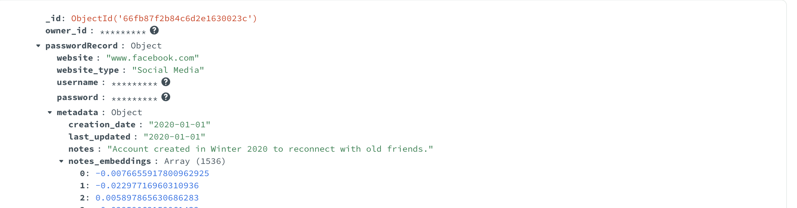
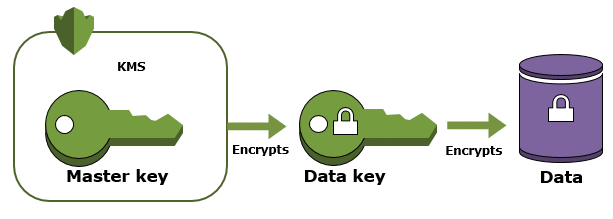
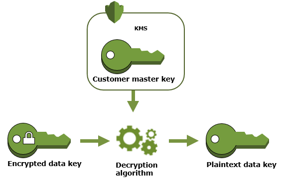
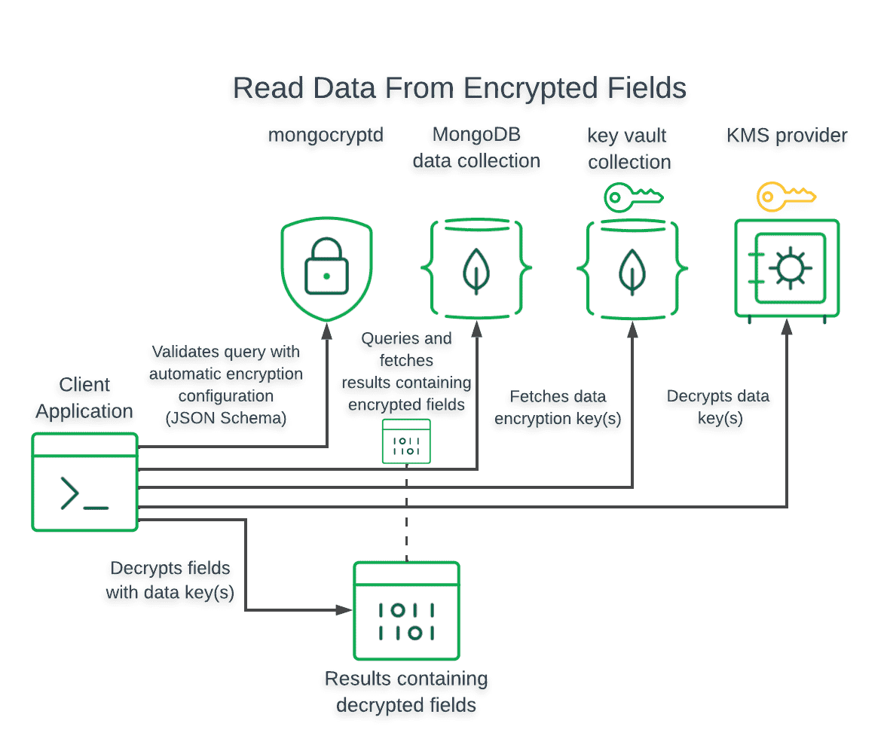

# mdb-crypto-RAG



# Queryable Encryption + Automatic Encryption(Atlas) + RAG
### For this tutorial/demo, need to have [mongocryptd](https://www.mongodb.com/docs/manual/core/queryable-encryption/reference/mongocryptd/) properly configured. This is a critical step

### You can set up Queryable Encryption using the following mechanisms:
- Automatic Encryption: Enables you to perform encrypted read and write operations without you having to write code to specify how to encrypt fields.
- Explicit Encryption: Enables you to perform encrypted read and write operations through your MongoDB driver's encryption library. You must specify the logic for encryption with this library throughout your application.

Today we will be focusing on Automatic Encryption using MongoDB Atlas. But before, lets talk a little bit about Envelope Encryption - which is what Queryable Encryption uses under the hood.

# Envelope Encryption
An analogy that helped me understand this was - think of a "Lockbox".


We will have a Customer Master Key (CMK) - which in our analogy will be the combination to the lockbox itself.
And with this CMK, we will protect the "keys inside".

The "keys inside" are going to be called the Data Encryption Keys (DEK). These are the keys that will be used to actually encrypt/decrypt the fields. And access to them will be protected by the CMK.

## Encrypt


## Decrypt


**Envelope Encryption: A Deeper Dive**

Envelope encryption is a cryptographic technique that involves using two layers of encryption to protect sensitive data. It's a core component of MongoDB's Queryable Encryption (QE) and provides a robust security mechanism.

### Understanding the Layers

1. **Data Encryption Key (DEK):** This is a unique key generated for each piece of data to be encrypted. The DEK is used to directly encrypt and decrypt the data.
2. **Customer Master Key (CMK):** The CMK is a key that protects the DEKs. It's typically stored in a secure hardware security module (HSM) or a cloud-based key management service.

### The Encryption Process

1. **Data Encryption:** The DEK is used to encrypt the sensitive data, creating a ciphertext.
2. **DEK Encryption:** The DEK itself is encrypted using the CMK, creating a ciphertext for the DEK.
3. **Storage:** Both the ciphertext (encrypted data) and the encrypted DEK are stored in the MongoDB database.

### The Decryption Process

1. **DEK Decryption:** The CMK is used to decrypt the encrypted DEK, retrieving the original DEK.
2. **Data Decryption:** The DEK is used to decrypt the ciphertext, revealing the original data.

### Benefits of Envelope Encryption

* **Strong Security:** By using two layers of encryption, envelope encryption provides a high level of security against unauthorized access.
* **Flexibility:** It allows for different encryption algorithms and key management strategies to be used for the DEK and CMK.
* **Efficiency:** The DEK can be reused for multiple pieces of data, improving encryption efficiency.
* **Compliance:** Envelope encryption can help organizations comply with data privacy regulations by ensuring sensitive data is protected at rest.

**Visual Representation:**

```
[Plaintext] -> [DEK] -> [Ciphertext]
[DEK] -> [CMK] -> [Encrypted DEK]
```

**Key Considerations:**

* **CMK Management:** Ensure the CMK is stored securely and managed properly.
* **DEK Rotation:** Regularly rotate DEKs to enhance security.
* **Key Length:** Use appropriate key lengths for both the DEK and CMK to provide adequate security.
* **Encryption Algorithms:** Choose strong encryption algorithms for both the DEK and CMK.

By understanding the principles of envelope encryption and its role in MongoDB's Queryable Encryption, you can make informed decisions about protecting sensitive data within your MongoDB applications.

# Automatic Encryption/Decryption
Automatic encryption essentially fetches the keys from the keyvault automatically and lets you get straight to encrypting/decrypting.
To encrypt/decrypt your fields automatically, you must configure your MongoClient instance as follows:
- Specify your Key Vault collection
- Specify a kmsProviders object

# Writing an Encrypted Field


# Reading an Encrypted Field


# Now for the good stuff. Let's see some code in action!

## Setting Up a Local Atlas Environment

1. **Pull the Docker Image:**

   * **Latest Version:**
     ```bash
     docker pull mongodb/mongodb-atlas-local
     ```

2. **Run the Database:**

   ```bash
   docker run -p 27017:27017 mongodb/mongodb-atlas-local
   ```
   This command runs the Docker image, exposing port 27017 on your machine for connecting to the database.

## Usage

The script `password_assistant.py` is the main entry point of the application. It performs the following tasks:

- Generates a local master key and sets up the KMS providers.
- Configures the MongoClient to use the local KMS provider.
- Creates a data encryption key.
- Encrypts a sample document and inserts it into the collection.
- Creates a MongoDB Atlas Vector Search index.
- Queries the encrypted data using the encrypted client.
- Uses Azure OpenAI to generate chat completions.

To run the script, use the following command:

```bash
python3 password_assistant.py
```


## Setting Up the Environment

First, we import the necessary libraries and define some helper functions. We use the `pymongo` library to interact with MongoDB, and the `openai` library to interact with Azure OpenAI. We also define a function `get_current_timeframe()` to get the current month and day.

```python
import os
import time
import pymongo
from pymongo.encryption import AutoEncryptionOpts, ClientEncryption, Algorithm
from bson.codec_options import CodecOptions
from bson.binary import STANDARD
from openai import AzureOpenAI
from pymongo.operations import SearchIndexModel
from datetime import datetime, timedelta

```

## Connecting to Azure OpenAI

Next, we connect to Azure OpenAI using the endpoint, API version, and API key. We also define a function `generate_embeddings()` to generate embeddings for a given text.

```python
azure_endpoint="https://demo.openai.azure.com"
api_version="2024-04-01-preview"
api_key=""
az_client = AzureOpenAI(azure_endpoint=azure_endpoint, api_version=api_version, api_key=api_key)
VS_INPUT = "family" # this will be used for vector search
def generate_embeddings(text, model="text-embedding-ada-002"): 
        return az_client.embeddings.create(input = [text], model=model).data[0].embedding
```

## Setting Up MongoDB Client-Side Field Level Encryption

We then set up MongoDB's client-side field level encryption. We generate a 96-byte local master key and set up the KMS providers with the local master key. We configure the MongoClient to use the local KMS provider and create a data encryption key.

```python
local_master_key = os.urandom(96)
kms_providers = {"local": {"key": local_master_key}}
key_vault_namespace = "encryption.__pymongoTestKeyVault"
csfle_opts = AutoEncryptionOpts(
    kms_providers=kms_providers,
    key_vault_namespace=key_vault_namespace
)
client = pymongo.MongoClient(auto_encryption_opts=csfle_opts)
```

## Creating the Encrypted Collection

We then create an encrypted collection in MongoDB. We define the fields to be encrypted and their encryption keys. We also insert some sample documents into the collection.

```python
encrypted_database_name = "test_db"
encrypted_collection_name = "pwd_manager"
encrypted_fields_map = {
    "fields": [
        {
            "path": "passwordRecord.username",
            "bsonType": "string",
            "keyId": key_id1,
            "queries": {"queryType": "equality"}
        },
        {
            "path": "passwordRecord.password",
            "bsonType": "string",
            "keyId": key_id2,
        },
        {
            "path": "owner_id",
            "bsonType": "string",
            "keyId": key_id3,
            "queries": {"queryType": "equality"}
        },
    ]
}
```

## Creating MongoDB Atlas Vector Search Index

We then create a MongoDB Atlas Vector Search index on the `notes_embeddings` field. This allows us to perform similarity searches on the embeddings generated by Azure OpenAI.

```python
search_index_model = SearchIndexModel(
    definition={
        "fields": [
            {
                "type": "vector",
                "numDimensions": 1536,
                "path": "passwordRecord.metadata.notes_embeddings",
                "similarity": "cosine"
            },
        ]
    },
    name="vector_index",
    type="vectorSearch",
)
encrypted_collection.create_search_index(search_index_model)
```

## Querying the Encrypted Data

Finally, we query the encrypted data using the encrypted client. We use the MongoDB Atlas Vector Search index to find the document with the most similar `notes_embeddings` to the current month and day. We also use the `owner_id` field to filter the documents using Queryable Encryption! `owner_id` is actually encrypted, and we can still query over it!

## **MongoDB Queryable Encryption: A Powerful Tool for Data Security**

MongoDB Queryable Encryption (MQE) offers a robust solution for protecting sensitive data within MongoDB databases while maintaining efficient querying capabilities. By encrypting data at rest, in transit, and even during queries, MQE significantly enhances data security and helps organizations comply with data privacy regulations.

**Key benefits:**

* **Enhanced data security:** Protects sensitive data from unauthorized access or breaches.
* **Efficient querying:** Allows you to perform queries directly on encrypted data without decryption.
* **Compliance adherence:** Helps organizations comply with data privacy regulations like GDPR and HIPAA.
* **Flexible querying:** Supports a wide range of query operations on encrypted data.
* **Integration with MongoDB features:** Seamlessly integrates with other MongoDB features, such as indexing and aggregation.

**Use cases:**

* Healthcare applications
* Financial services
* Government agencies
* Any organization that handles sensitive data

**Factors to consider:**

* Key management
* Performance impact
* Integration with other security measures

By leveraging the power of MongoDB Queryable Encryption, organizations can effectively protect sensitive data while maintaining the ability to extract valuable insights and comply with data privacy regulations.

```python
query_result = list(encrypted_collection.aggregate([
        {
            "$vectorSearch": {
                "index": "vector_index",
                "queryVector": az_client.embeddings.create(model="text-embedding-ada-002",input=VS_INPUT ).data[0].embedding,
                "path": "passwordRecord.metadata.notes_embeddings",
                "limit": 1,
                "numCandidates": 30
            },
        },
        {"$match": {"owner_id": "demo.user"}}, #queryable encryption
        {"$project":{"logs_info":1, "passwordRecord.username":1, "passwordRecord.website":1, "passwordRecord.website_type":1, "passwordRecord.metadata.creation_date":1, "passwordRecord.metadata.last_updated":1, "passwordRecord.metadata.notes":1}}
        ]))
```

## Code Explanation

The script starts by importing the necessary modules and setting up the Azure OpenAI client with the endpoint, API version, and API key.

The `generate_embeddings` function is used to generate embeddings for a given text using the Azure OpenAI client.

A local master key is generated and the KMS providers are set up with this key. The MongoClient is then configured to use the local KMS provider.

The script then creates a data encryption key and encrypts a sample document. The encrypted document is inserted into the collection.

A MongoDB Atlas Vector Search index is created for the encrypted collection. The script then waits for the index to be ready before proceeding.

The script then queries the encrypted data using the encrypted client and prints the result.

Finally, the script uses the Azure OpenAI client to generate chat completions using the queried data.

## Sample Output
```

```

## Full Code
```python
import os
import time
import pymongo
from pymongo.encryption import AutoEncryptionOpts, ClientEncryption, Algorithm
from bson.codec_options import CodecOptions
from bson.binary import STANDARD
from openai import AzureOpenAI
from pymongo.operations import SearchIndexModel
from datetime import datetime, timedelta


VS_INPUT = "family" # this will be used for vector search
azure_endpoint="https://demo.openai.azure.com"
api_version="2024-04-01-preview"
api_key=""
az_client = AzureOpenAI(azure_endpoint=azure_endpoint, api_version=api_version, api_key=api_key)
def generate_embeddings(text, model="text-embedding-ada-002"): 
        return az_client.embeddings.create(input = [text], model=model).data[0].embedding
# Generate a 96-byte local master key
local_master_key = os.urandom(96)
# Set up the KMS providers with the local master key
kms_providers = {"local": {"key": local_master_key}}
key_vault_namespace = "encryption.__pymongoTestKeyVault"
# Configure the MongoClient to use the local KMS provider
csfle_opts = AutoEncryptionOpts(
    kms_providers=kms_providers,
    key_vault_namespace=key_vault_namespace
)
client = pymongo.MongoClient(auto_encryption_opts=csfle_opts)
try:
    key_vault_db, key_vault_coll = key_vault_namespace.split(".", 1)
    key_vault = client[key_vault_db][key_vault_coll]
    key_vault.drop()  # Clear existing data
    key_vault.create_index("keyAltNames", unique=True)
except pymongo.errors.InvalidName as e:
    print(f"Error creating key vault collection: {e}")
    # Handle invalid collection name errors gracefully
except pymongo.errors.DuplicateKeyError as e:
    print(f"Error creating index: {e}")
    # Handle duplicate index errors gracefully
try:
    client_encryption = ClientEncryption(
        kms_providers,
        key_vault_namespace,
        client,
        CodecOptions(uuid_representation=STANDARD)
    )
except pymongo.errors.EncryptionError as e:
    # Handle encryption errors gracefully
    print(f"Error creating ClientEncryption: {e}")
    # You might want to take specific actions here, such as retrying or logging
# Create a data encryption key
key_id1 = client_encryption.create_data_key("local", key_alt_names=["example1"])
key_id2 = client_encryption.create_data_key("local", key_alt_names=["example2"])
key_id3 = client_encryption.create_data_key("local", key_alt_names=["example3"])

# Encrypt a sample document and insert it into the collection
encrypted_database_name = "test_db"
encrypted_collection_name = "pwd_manager"
encrypted_fields_map = {
    "fields": [
        {
            "path": "passwordRecord.username",
            "bsonType": "string",
            "keyId": key_id1,
            "queries": {"queryType": "equality"}
        },
        {
            "path": "passwordRecord.password",
            "bsonType": "string",
            "keyId": key_id2,
        },
        {
            "path": "owner_id",
            "bsonType": "string",
            "keyId": key_id3,
            "queries": {"queryType": "equality"}
        },
    ]
}

# Create the encrypted collection
client_encryption.create_encrypted_collection(
    client[encrypted_database_name],
    encrypted_collection_name,
    encrypted_fields_map,
    "local",
    local_master_key
)

# Insert encrypted documents
password_manager_document_1 = {
     "owner_id": "demo.user",
    "passwordRecord": {
        "website": "www.facebook.com",
        "website_type": "Social Media",
        "username": "jondoe1",
        "password": "password1",
        "metadata": {
            "creation_date": "2020-01-01",
            "last_updated": "2020-01-01",
            "notes": "Account created in Winter 2020 to reconnect with old friends.",
            "notes_embeddings":generate_embeddings("Account created in Winter 2020 to reconnect with old friends.")
        }
    },
    "logs_info": [{
        "ipAddress": "192.0.2.0",
        "attemptStatus": "success",
        "website": "www.facebook.com",
        "timestamp": datetime.now()-timedelta(hours=3),
    }, {
        "ipAddress": "192.0.2.1",  # Suspicious IP
        "attemptStatus": "fail",
        "website": "www.facebook.com",
        "timestamp": datetime.now()-timedelta(hours=2),
    }, {
        "ipAddress": "192.0.2.1",
        "attemptStatus": "fail",
        "website": "www.facebook.com",
        "timestamp": datetime.now()-timedelta(hours=1),
    }]
}

password_manager_document_2 = {
     "owner_id": "demo.user",
    "passwordRecord": {
        "website": "www.amazon.com",
        "website_type": "E-commerce",
        "username": "jondoe2",
        "password": "password2",
        "metadata": {
            "creation_date": "2020-06-01",
            "last_updated": "2020-06-01",
            "notes": "Account created in Summer 2020 for online shopping.",
            "notes_embeddings":generate_embeddings("Account created in Summer 2020 for online shopping.")
        }
    },
    "logs_info": [{
        "ipAddress": "192.0.2.0",
        "attemptStatus": "success",
        "website": "www.amazon.com",
        "timestamp": datetime.now()-timedelta(hours=3),
    }, {
        "ipAddress": "192.0.2.0",
        "attemptStatus": "success",
        "website": "www.amazon.com",
        "timestamp": datetime.now()-timedelta(hours=2),
    }, {
        "ipAddress": "192.0.2.2", 
        "attemptStatus": "fail",
        "website": "www.amazon.com",
        "timestamp": datetime.now()-timedelta(hours=1),
    }]
}

password_manager_document_3 = {
     "owner_id": "demo.user",
    "passwordRecord": {
        "website": "www.nytimes.com",
        "website_type": "News",
        "username": "jondoe2",
        "password": "password3",
        "metadata": {
            "creation_date": "2020-11-01",
            "last_updated": "2020-11-01",
            "notes": "Account created in Fall 2020 for keeping up with global news.",
            "notes_embeddings":generate_embeddings("Account created in Fall 2020 for keeping up with global news.")
        }
    },
    "logs_info": [{
        "ipAddress": "192.0.2.0",
        "attemptStatus": "success",
        "website": "www.nytimes.com",
        "timestamp": datetime.now()-timedelta(hours=3),
    }, {
        "ipAddress": "192.0.2.0",
        "attemptStatus": "success",
        "website": "www.nytimes.com",
        "timestamp": datetime.now()-timedelta(hours=2),
    }, {
        "ipAddress": "192.0.2.3",  
        "attemptStatus": "fail",
        "website": "www.nytimes.com",
        "timestamp": datetime.now()-timedelta(hours=1),
    }]
}
encrypted_collection = client[encrypted_database_name][encrypted_collection_name]
result = encrypted_collection.insert_many([password_manager_document_1, password_manager_document_2, password_manager_document_3])

# Create MongoDB Atlas Vector Search index
# Define the search index model
search_index_model = SearchIndexModel(
    definition={
        "fields": [
            {
                "type": "vector",
                "numDimensions": 1536,
                "path": "passwordRecord.metadata.notes_embeddings",
                "similarity": "cosine"
            },
        ]
    },
    name="vector_index",
    type="vectorSearch",
)
encrypted_collection.create_search_index(search_index_model)
print("Lets wait for index to be ready...")
start_time = time.time()
# add sleep delay for at least 10 seconds, printing a time counter, to show progress
time.sleep(10)
print("Time elapsed: ", time.time() - start_time)
print(list(encrypted_collection.list_search_indexes()))
# Query the encrypted data using the encrypted client
query_result = list(encrypted_collection.aggregate([
        {
            "$vectorSearch": {
                "index": "vector_index",
                "queryVector": az_client.embeddings.create(model="text-embedding-ada-002",input=VS_INPUT ).data[0].embedding,
                "path": "passwordRecord.metadata.notes_embeddings",
                "limit": 1,
                "numCandidates": 30
            },
        },
        {"$match": {"owner_id": "demo.user"}}, #queryable encryption
        {"$project":{"logs_info":1, "passwordRecord.username":1, "passwordRecord.website":1, "passwordRecord.website_type":1, "passwordRecord.metadata.creation_date":1, "passwordRecord.metadata.last_updated":1, "passwordRecord.metadata.notes":1}}
        ]))
print(
    query_result[0]
)
az_response = az_client.chat.completions.create(
                model="gpt-35-turbo", # model = "deployment_name".
                messages=[
                    {"role": "system", "content": "You are a helpful assistant."},
                    {"role": "user", "content": "[context]\n```" + str(query_result[0]) +"\n```\n[end context]"},
                    {"role": "user", "content": "Using ONLY the [context], summarize the context in list format. Use emojis."},
                ]
            )
print(
    az_response.choices[0].message.content
)
```

## Conclusion

In this tutorial, we have explored how to leverage MongoDB's Queryable Encryption with Automatic Encryption and Azure OpenAI to enhance data security while maintaining efficient querying capabilities. We have walked through the process of setting up a local Atlas environment, generating a local master key, configuring the MongoClient, creating a data encryption key, and encrypting some documents.

We also delved into the creation of a MongoDB Atlas Vector Search index and how to query encrypted data using the encrypted client. Furthermore, we discussed the benefits of MongoDB Queryable Encryption, including enhanced data security, efficient querying, compliance adherence, and seamless integration with other MongoDB features.

As we move towards a data-driven world, the importance of data security cannot be overstated. Tools like MongoDB's Queryable Encryption and Azure OpenAI provide powerful solutions for protecting sensitive data while still allowing for efficient data analysis and extraction of valuable insights. 

Remember, while this tutorial provides a good starting point, it's essential to understand your specific use case and requirements to effectively implement these tools. Always consider factors like key management, performance impact, and integration with other security measures. 

We hope this tutorial has been informative and helpful in your journey to better data security and efficient querying. Happy coding!
