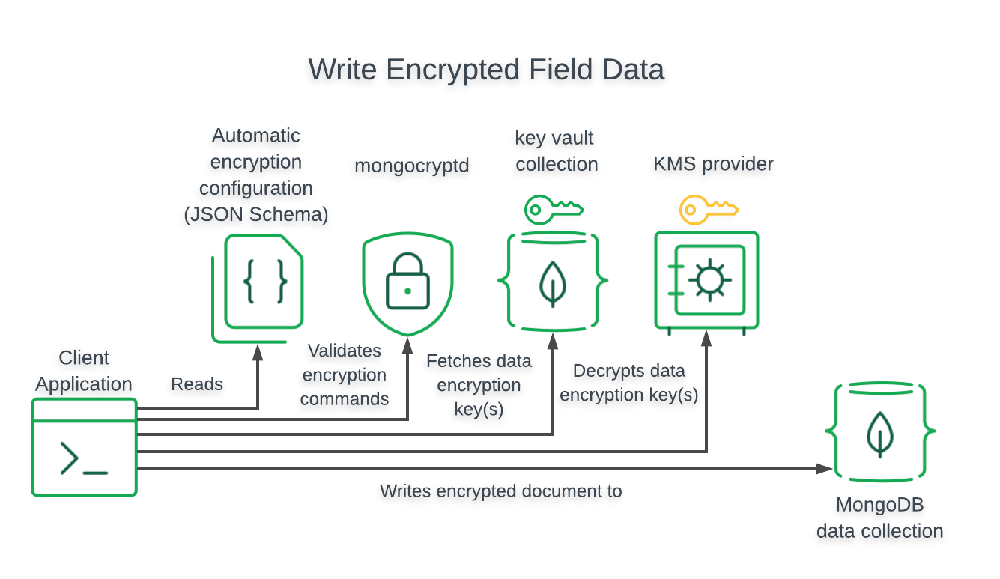

# mdb-crypto-RAG

# Queryable Encryption + Automatic Encryption(Atlas) + RAG
### For this tutorial/demo, need to have mongocryptd or the shared_lib properly configured. This is a critical step

https://www.mongodb.com/docs/manual/core/queryable-encryption/reference/shared-library

https://www.mongodb.com/docs/manual/core/queryable-encryption/reference/mongocryptd/

### You can set up Queryable Encryption using the following mechanisms:
- Automatic Encryption: Enables you to perform encrypted read and write operations without you having to write code to specify how to encrypt fields.
- Explicit Encryption: Enables you to perform encrypted read and write operations through your MongoDB driver's encryption library. You must specify the logic for encryption with this library throughout your application.

Today we will be focusing on Automatic Encryption using MongoDB Atlas. But before, lets talk a little bit about Envelope Encryption - which is what Queryable Encryption uses under the hood.

# Envelope Encryption
An analogy that helped me understand this was - think of a "Lockbox".


We will have a Customer Master Key (CMK) - which in our analogy will be the combination to the lockbox itself.
And with this CMK, we will protect the "keys inside".

The "keys inside" are going to be called the Data Encryption Keys (DEK). These are the keys that will be used to actually encrypt/decrypt the fields. And access to them will be protected by the CMK.

## Encrypt


## Decrypt


# Automatic Encryption/Decryption
Automatic encryption essentially fetches the keys from the keyvault automatically and lets you get straight to encrypting/decrypting.
To encrypt/decrypt your fields automatically, you must configure your MongoClient instance as follows:
- Specify your Key Vault collection
- Specify a kmsProviders object

# Writing an Encrypted Field


# Reading an Encrypted Field


# Now for the good stuff. Let's see some code in action!

## Usage

The script `password_manager.py` is the main entry point of the application. It performs the following tasks:

- Generates a local master key and sets up the KMS providers.
- Configures the MongoClient to use the local KMS provider.
- Creates a data encryption key.
- Encrypts a sample document and inserts it into the collection.
- Creates a MongoDB Atlas Vector Search index.
- Queries the encrypted data using the encrypted client.
- Uses Azure OpenAI to generate chat completions.

To run the script, use the following command:

```bash
python3 password_manager.py
```


## Setting Up the Environment

First, we import the necessary libraries and define some helper functions. We use the `pymongo` library to interact with MongoDB, and the `openai` library to interact with Azure OpenAI. We also define a function `get_current_timeframe()` to get the current month and day.

```python
import os
import time
import pymongo
from pymongo.encryption import AutoEncryptionOpts, ClientEncryption, Algorithm
from bson.codec_options import CodecOptions
from bson.binary import STANDARD
from openai import AzureOpenAI
from pymongo.operations import SearchIndexModel
from datetime import datetime, timedelta

```

## Connecting to Azure OpenAI

Next, we connect to Azure OpenAI using the endpoint, API version, and API key. We also define a function `generate_embeddings()` to generate embeddings for a given text.

```python
azure_endpoint="https://demo.openai.azure.com"
api_version="2024-04-01-preview"
api_key=""
az_client = AzureOpenAI(azure_endpoint=azure_endpoint, api_version=api_version, api_key=api_key)
VS_INPUT = "family" # this will be used for vector search
def generate_embeddings(text, model="text-embedding-ada-002"): 
        return az_client.embeddings.create(input = [text], model=model).data[0].embedding
```

## Setting Up MongoDB Client-Side Field Level Encryption

We then set up MongoDB's client-side field level encryption. We generate a 96-byte local master key and set up the KMS providers with the local master key. We configure the MongoClient to use the local KMS provider and create a data encryption key.

```python
local_master_key = os.urandom(96)
kms_providers = {"local": {"key": local_master_key}}
key_vault_namespace = "encryption.__pymongoTestKeyVault"
csfle_opts = AutoEncryptionOpts(
    kms_providers=kms_providers,
    key_vault_namespace=key_vault_namespace
)
client = pymongo.MongoClient(auto_encryption_opts=csfle_opts)
```

## Creating the Encrypted Collection

We then create an encrypted collection in MongoDB. We define the fields to be encrypted and their encryption keys. We also insert some sample documents into the collection.

```python
encrypted_database_name = "test_db"
encrypted_collection_name = "pwd_manager"
encrypted_fields_map = {
    "fields": [
        {
            "path": "passwordRecord.username",
            "bsonType": "string",
            "keyId": key_id1,
            "queries": {"queryType": "equality"}
        },
        {
            "path": "passwordRecord.password",
            "bsonType": "string",
            "keyId": key_id2,
        },
        {
            "path": "owner_id",
            "bsonType": "string",
            "keyId": key_id3,
            "queries": {"queryType": "equality"}
        },
    ]
}
```

## Creating MongoDB Atlas Vector Search Index

We then create a MongoDB Atlas Vector Search index on the `notes_embeddings` field. This allows us to perform similarity searches on the embeddings generated by Azure OpenAI.

```python
search_index_model = SearchIndexModel(
    definition={
        "fields": [
            {
                "type": "vector",
                "numDimensions": 1536,
                "path": "passwordRecord.metadata.notes_embeddings",
                "similarity": "cosine"
            },
        ]
    },
    name="vector_index",
    type="vectorSearch",
)
encrypted_collection.create_search_index(search_index_model)
```

## Querying the Encrypted Data

Finally, we query the encrypted data using the encrypted client. We use the MongoDB Atlas Vector Search index to find the document with the most similar `notes_embeddings` to the current month and day. We also use the `owner_id` field to filter the documents using Queryable Encryption! `owner_id` is actually encrypted, and we can still query over it!

## **MongoDB Queryable Encryption: A Powerful Tool for Data Security**

MongoDB Queryable Encryption (MQE) offers a robust solution for protecting sensitive data within MongoDB databases while maintaining efficient querying capabilities. By encrypting data at rest, in transit, and even during queries, MQE significantly enhances data security and helps organizations comply with data privacy regulations.

**Key benefits:**

* **Enhanced data security:** Protects sensitive data from unauthorized access or breaches.
* **Efficient querying:** Allows you to perform queries directly on encrypted data without decryption.
* **Compliance adherence:** Helps organizations comply with data privacy regulations like GDPR and HIPAA.
* **Flexible querying:** Supports a wide range of query operations on encrypted data.
* **Integration with MongoDB features:** Seamlessly integrates with other MongoDB features, such as indexing and aggregation.

**Use cases:**

* Healthcare applications
* Financial services
* Government agencies
* Any organization that handles sensitive data

**Factors to consider:**

* Key management
* Performance impact
* Integration with other security measures

By leveraging the power of MongoDB Queryable Encryption, organizations can effectively protect sensitive data while maintaining the ability to extract valuable insights and comply with data privacy regulations.

```python
query_result = list(encrypted_collection.aggregate([
        {
            "$vectorSearch": {
                "index": "vector_index",
                "queryVector": az_client.embeddings.create(model="text-embedding-ada-002",input=VS_INPUT ).data[0].embedding,
                "path": "passwordRecord.metadata.notes_embeddings",
                "limit": 1,
                "numCandidates": 30
            },
        },
        {"$match": {"owner_id": "demo.user"}}, #queryable encryption
        {"$project":{"logs_info":1, "passwordRecord.username":1, "passwordRecord.website":1, "passwordRecord.website_type":1, "passwordRecord.metadata.creation_date":1, "passwordRecord.metadata.last_updated":1, "passwordRecord.metadata.notes":1}}
        ]))
```

## Code Explanation

The script starts by importing the necessary modules and setting up the Azure OpenAI client with the endpoint, API version, and API key.

The `generate_embeddings` function is used to generate embeddings for a given text using the Azure OpenAI client.

A local master key is generated and the KMS providers are set up with this key. The MongoClient is then configured to use the local KMS provider.

The script then creates a data encryption key and encrypts a sample document. The encrypted document is inserted into the collection.

A MongoDB Atlas Vector Search index is created for the encrypted collection. The script then waits for the index to be ready before proceeding.

The script then queries the encrypted data using the encrypted client and prints the result.

Finally, the script uses the Azure OpenAI client to generate chat completions using the queried data.

## Troubleshooting

If you encounter any errors while running the script, make sure that your MongoDB server is running and that you have correctly set up your Azure OpenAI account.
